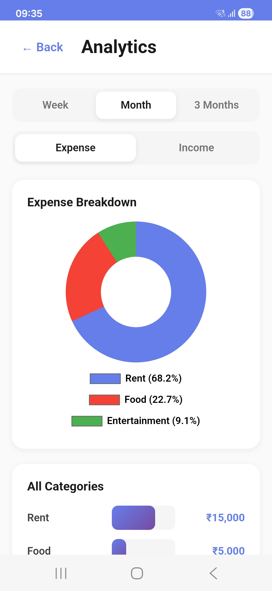
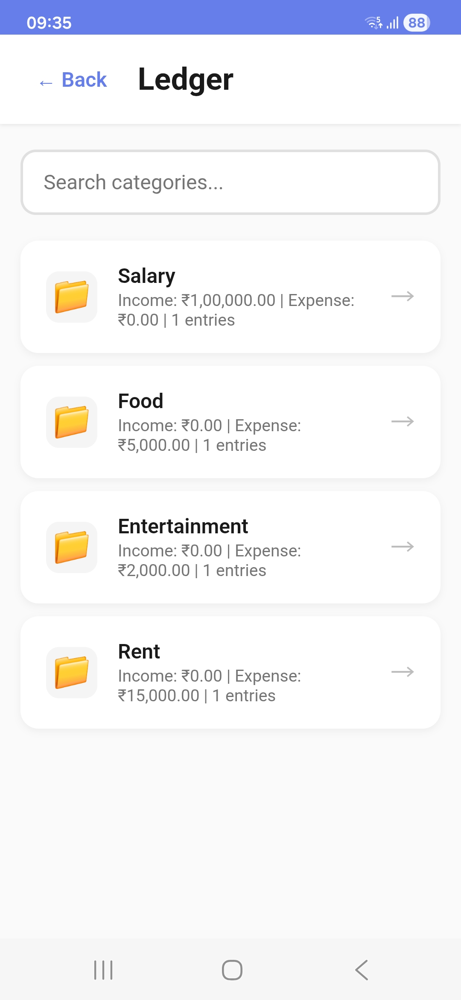
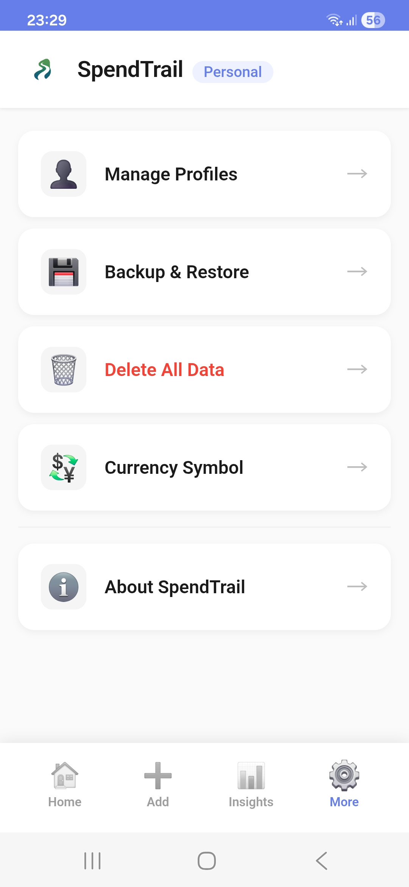

# 💰 SpendTrail

> A modern, privacy-focused expense and income tracker with multi-profile and multi-currency support built as a Progressive Web App (PWA)

[](https://mananmadani.github.io/SpendTrail/)
[](https://github.com/mananmadani/SpendTrail)
[]()
[]()
[]()

## 📖 About

SpendTrail is a lightweight, privacy-first expense tracker that runs entirely in your browser. No servers, no accounts, no tracking - just you and your financial data. Built with vanilla JavaScript and modern web technologies, it offers a seamless experience across all devices while keeping your data completely private. 

## 📸 Screenshots

<div align="center">

### Dashboard & Overview


### Add Transactions


### Analytics & Insights


### Ledger View


### More


</div>

## ✨ Key Features

### Core Functionality
- 📊 **Income & Expense Tracking** - Simple, intuitive entry system with categories and notes
- 💱 **Multi-Currency Support** - Choose from 30 currency symbols (₹, $, €, £, ¥, and more)
- 📈 **Visual Analytics** - Beautiful pie charts, bar graphs, and trend analysis
- 💰 **Real-time Balance** - Instant overview of your financial status
- 📁 **Category Management** - Organize transactions with custom categories
- 🔍 **Smart Search** - Search transactions by category or note in real-time

### Advanced Features
- 👤 **Multi-Profile Support** - Up to 5 fully isolated profiles for personal, business, family, or travel finances
- 📅 **Custom Statements** - Generate reports for any date range
- 📄 **Professional PDF Export** - Beautiful, color-coded reports with tables and summaries
- 💾 **Backup & Restore** - Simple JSON or AES-256 encrypted backups per profile
- 📋 **Complete Ledger** - View all entries with powerful filtering and search

### Technical Highlights
- 🔒 **Privacy First** - All data stored locally using localStorage
- 🌙 **PWA Support** - Install as native app on any device
- 📱 **Fully Responsive** - Optimized for mobile, tablet, and desktop
- ⚡ **Offline Support** - Works without internet connection
- 🎨 **Modern UI** - Clean, minimalist design with smooth animations

## 👤 Multi-Profile System

SpendTrail v3.9 introduces fully isolated profiles — each profile acts as a completely separate instance of the app:

- **Up to 5 profiles** — Personal, Business, Travel, Family, and more
- **Complete isolation** — transactions, categories, currency settings and analytics are all separate per profile
- **Profile indicator** — active profile name always visible in the app header
- **Easy switching** — switch profiles from More → Manage Profiles
- **Safe migration** — existing users' data is automatically migrated to the default Personal profile on first launch, with zero data loss
- **Profile-aware exports** — backup files and PDF reports include the profile name

## 🌍 Supported Currencies

SpendTrail supports **30 currency symbols** from around the world:

**Asia:** INR, JPY, CNY, SGD, HKD, MYR, THB, IDR, PKR, BDT, KRW

**Europe:** EUR, GBP, CHF, SEK, NOK, DKK, PLN, TRY, RUB

**Americas:** USD, CAD, BRL, MXN, AUD, NZD

**Middle East:** AED, SAR, QAR

**Africa:** ZAR

*Note: Currency selection only changes the display symbol. No conversion calculations are performed. Each profile can have its own currency setting.*

## 🚀 Quick Start

### 🌐 Try Online
**No installation required!** Visit: [SpendTrail App](https://mananmadani.github.io/SpendTrail/)

### 📱 Install as App

<details>
<summary><b>Android / Chrome</b></summary>

1. Visit the [SpendTrail App](https://mananmadani.github.io/SpendTrail/)
2. Tap the menu (⋮) in the top-right corner
3. Select **"Install app"** or **"Add to Home screen"**
4. SpendTrail will be added to your home screen
</details>

<details>
<summary><b>iOS / Safari</b></summary>

1. Visit the [SpendTrail App](https://mananmadani.github.io/SpendTrail/)
2. Tap the **Share** button (square with arrow)
3. Scroll down and select **"Add to Home Screen"**
4. Tap **"Add"** to confirm
</details>

<details>
<summary><b>Desktop (Chrome, Edge, Brave)</b></summary>

1. Visit the [SpendTrail App](https://mananmadani.github.io/SpendTrail/)
2. Look for the **install icon** (⊕) in the address bar
3. Click it and select **"Install"**
4. SpendTrail will open as a standalone app
</details>

## 🛠️ Tech Stack

| Category | Technology |
|----------|-----------|
| **Frontend** | Vanilla JavaScript (ES6+) |
| **Styling** | Custom CSS3 with Flexbox/Grid |
| **Storage** | LocalStorage API |
| **Charts** | Chart.js v4.4.0 |
| **PWA** | Service Workers, Web App Manifest |
| **PDF** | jsPDF v2.5.1 |
| **Encryption** | CryptoJS v4.1.1 (AES-256) |

## 💻 Local Development

### Prerequisites
- A modern web browser (Chrome, Firefox, Safari, Edge)
- Python 3 (optional, for local server)

### Installation

```bash
# Clone the repository
git clone https://github.com/mananmadani/SpendTrail.git

# Navigate to directory
cd SpendTrail

# Option 1: Open directly
# Simply open index.html in your browser

# Option 2: Use local server (recommended)
python -m http.server 8000

# Visit http://localhost:8000
```

## 📁 Project Structure

```
SpendTrail/
├── index.html                    # Main HTML file
├── app.js                        # Core application logic
├── style.css                     # Styles and themes
├── manifest.json                 # PWA manifest for installable app
├── service-worker.js             # Service worker for offline support
├── SpendTrail.png                # App icon (1024x1024)
├── screenshots/                  # App screenshots for README
│   ├── dashboard.jpg
│   ├── add-transaction.jpg
│   ├── analytics.jpg
│   ├── ledger.jpg
│   └── more.jpg
├── README.md                     # Project documentation
├── LICENSE                       # MIT License
└── .gitignore                    # Git ignore rules
```

### 📋 File Descriptions

| File | Purpose |
|------|---------|
| `index.html` | Main application entry point |
| `app.js` | Core JavaScript logic for transactions, analytics, profiles and storage |
| `style.css` | All styling including responsive design and animations |
| `manifest.json` | PWA configuration for app installation |
| `service-worker.js` | Enables offline functionality and app caching |
| `SpendTrail.png` | App icon used for PWA and branding |
| `screenshots/` | Directory containing app screenshots for documentation |
| `README.md` | This file - comprehensive project documentation |
| `LICENSE` | MIT License terms and conditions |
| `.gitignore` | Specifies files to exclude from version control |

## 📚 Usage Guide

### Managing Profiles

1. Go to **More → Manage Profiles**
2. Your current active profile is highlighted with a blue border and **● Active** badge
3. **Switch profile** — tap any inactive profile card to switch to it
4. **Create profile** — tap **＋ New Profile**, enter a name (max 20 characters, up to 5 profiles)
5. **Rename profile** — tap **Rename** on any profile card
6. **Delete profile** — tap **Delete** on any inactive profile (permanently removes all its data)
7. The active profile name is always visible next to the SpendTrail logo in the header

### Setting Your Currency

1. Go to **More → Currency Symbol**
2. Select your preferred currency from the dropdown
3. The setting is saved per profile — each profile can have a different currency

### Adding Transactions

1. Click the **Add** tab in the bottom navigation
2. Toggle between **Income** or **Expense**
3. Enter:
   - **Amount** (e.g., 500.00)
   - **Category** (e.g., Food, Salary, Rent) — suggestions shown from current profile only
   - **Date** (defaults to today)
   - **Note** (optional)
4. Click **"Add Income"** or **"Add Expense"**

### Searching Transactions

1. Go to **Insights → All Entries**
2. Use the **search bar** to filter by category or note
3. Search works in real-time as you type
4. Combine with Income/Expense filters for precise results

### Viewing Analytics

1. Go to **Insights → Analytics**
2. Filter by time period (**Week** / **Month** / **3 Months**)
3. Toggle between **Income** and **Expense** analytics
4. View:
   - 🥧 **Pie Chart** - Category breakdown with percentages
   - 📊 **Bar Chart** - All categories sorted by amount
   - 📈 **Trend Chart** - Daily income vs expense trends

### Generating Custom Statements

1. Go to **Insights → Custom Statement**
2. Select **Start Date** and **End Date**
3. Click **"Generate"** to view transactions
4. Click **"Export PDF"** to download a professional report

### Exporting PDF Reports

1. Go to **Insights → Export PDF** for a complete financial report of the active profile
2. The PDF filename includes the profile name (e.g. `SpendTrail-Personal.pdf`)
3. For a specific date range, use **Insights → Custom Statement → Export PDF**

### Managing Your Data

**Backup Options:**

- **Simple Backup**: Go to **More → Backup Data** (JSON format, includes profile name in filename)
- **Encrypted Backup**: Go to **More → Encrypted Backup** (AES-256 encrypted, password-protected)

*Note: Backups are per-profile. Each profile's data is backed up and restored independently.*

**Restore Data:**

1. Go to **More → Restore Data**
2. Select your backup file (`.json` or `.encrypted`)
3. Enter password (if encrypted)
4. Confirm restoration — data will be restored into the currently active profile

### Edit or Delete Transactions

1. **Long press** (or click and hold) any transaction
2. A context menu will appear with options:
   - ✏️ **Edit** - Modify the transaction
   - 🗑️ **Delete** - Remove the transaction
   - **Cancel** - Close the menu

## 🎨 PDF Report Features

SpendTrail generates professional PDF reports with:

📊 **Color-coded Summary Cards**
- Green card for total income
- Red card for total expenses
- Blue card for balance

📋 **Clean Table Layout**
- Column headers (Date, Category, Note, Amount)
- Alternating row backgrounds for readability
- Green text for income, red for expense
- Currency symbols displayed as text codes (e.g., Rs., USD, EUR)

📄 **Professional Formatting**
- Profile name in report subtitle
- Automatic pagination with page numbers
- Headers repeated on each page
- Branded header with app name
- International date format support

*Note: PDF exports display currency symbols as readable text codes (Rs., USD, EUR, etc.) due to PDF font limitations.*

## 🔒 Privacy & Security

### Data Storage

✅ **100% Local Storage** - All data stored in your browser's localStorage
✅ **No Cloud Sync** - Data never leaves your device
✅ **No Tracking** - Zero analytics, cookies, or trackers
✅ **No Registration** - No accounts, emails, or personal info required
✅ **Profile Isolation** - Each profile's data is fully namespaced and separated

### Encryption

🔐 **AES-256 Encryption** - Military-grade encryption for backups
🔑 **Your Password Only** - Only you know the password
⚠️ **Password Recovery** - Not possible (by design for security)

### Data Control

📥 **Export Anytime** - Download your data in JSON or PDF
🗑️ **Delete Anytime** - Permanently delete all data in the active profile, or delete an entire profile
💾 **Backup Control** - Create backups per profile whenever you want

## 🤝 Contributing

Contributions, issues, and feature requests are welcome! Feel free to check the [issues page](https://github.com/mananmadani/SpendTrail/issues).

### How to Contribute

1. Fork the project
2. Create your feature branch
   ```bash
   git checkout -b feature/AmazingFeature
   ```
3. Commit your changes
   ```bash
   git commit -m 'Add some AmazingFeature'
   ```
4. Push to the branch
   ```bash
   git push origin feature/AmazingFeature
   ```
5. Open a Pull Request

### Development Guidelines

- Write clean, readable code
- Follow existing code style
- Test on multiple browsers
- Update documentation if needed

## 📝 Changelog

### v3.9 (March 2026)

✨ **New Features**
- 👤 **Multi-Profile Support** - Create up to 5 fully isolated profiles (Personal, Business, Travel, Family, etc.)
- 🔄 **Profile Switcher** - Manage and switch profiles from More → Manage Profiles
- 🏷️ **Profile Header Indicator** - Active profile name always visible in the app header
- 📄 **Profile-aware Exports** - Backup filenames and PDF reports now include the active profile name

🔧 **Improvements**
- **Export PDF moved to Insights tab** — sits alongside Analytics, All Entries, Ledger and Custom Statement where it logically belongs
- **Profile-scoped Delete All Data** — only clears data in the active profile, other profiles are untouched
- **Automatic migration** — existing users' data seamlessly migrated to a default Personal profile on first launch with zero data loss

### v3.8 (February 2026)

✨ **New Features**
- 💱 **Multi-Currency Support** - Choose from 30 currency symbols worldwide
- 🔍 **Search in All Entries** - Real-time search by category or note
- 💱 **Currency Settings** - Easily switch between different currency symbols

📚 **Improvements**
- Added GitHub support link for issue reporting
- Better PDF readability with currency text codes

### v3.7 (January 2026)

🐛 **Bug Fixes**
- Fixed minor bugs affecting app stability
- Improved overall app performance
- Enhanced error handling and validation

✨ **Improvements**
- Better stability and reliability
- Optimized resource usage
- Minor UI refinements

### v3.6 (December 2025)

🐛 **Bug Fixes**
- Fixed transaction sorting to prioritize date over timestamp
- Old entries now appear in correct chronological position
- Export PDF now uses proper date-based sorting

✨ **Improvements**
- Professional PDF exports with colored tables and summary cards
- Custom statement PDFs with period-specific summaries
- Better PDF layout with headers, footers, and page numbers
- Improved date formatting in PDFs (Indian format)

### v3.5 (November 2025)

- Added income analytics with charts
- Fixed entry sorting in custom statements
- Added empty state displays in ledger
- Enhanced privacy policy

### v3.4 (October 2025)

- Initial public release
- Basic income/expense tracking
- Simple analytics
- PDF export functionality

## 📄 License

This project is licensed under the MIT License - see the LICENSE file for details.

**What does this mean?**

✅ Free to use for personal and commercial projects
✅ Free to modify and distribute
✅ No warranty provided
❌ Author not liable for any damages

## 👨‍💻 Author

**Manan Madani**

- 🐙 GitHub: [@mananmadani](https://github.com/mananmadani)
- 🌐 Project: [SpendTrail](https://github.com/mananmadani/SpendTrail)
- 📧 Support: [Open an issue](https://github.com/mananmadani/SpendTrail/issues)

## ⭐ Show Your Support

If SpendTrail helped you manage your finances better, please consider:

- ⭐ Starring the repository
- 🐛 Reporting bugs or issues
- 💡 Suggesting new features
- 🔀 Contributing code improvements
- 📢 Sharing with friends and family

## 📬 Support & Feedback

- 🐛 **Bug Reports**: [Open an issue](https://github.com/mananmadani/SpendTrail/issues)
- 💡 **Feature Requests**: [Open an issue](https://github.com/mananmadani/SpendTrail/issues)
- ❓ **Questions**: [Discussions](https://github.com/mananmadani/SpendTrail/discussions)

---

**Made with ❤️ for better financial tracking**
