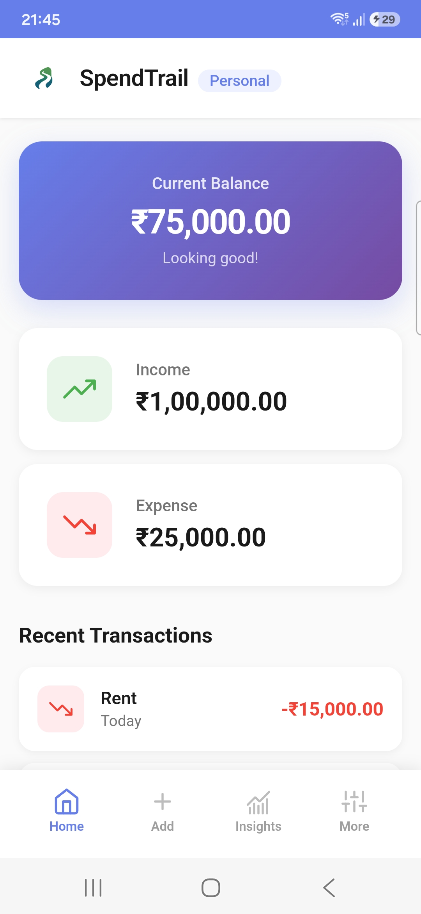
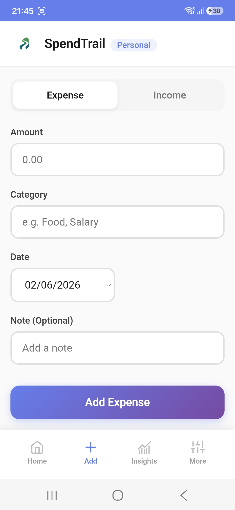
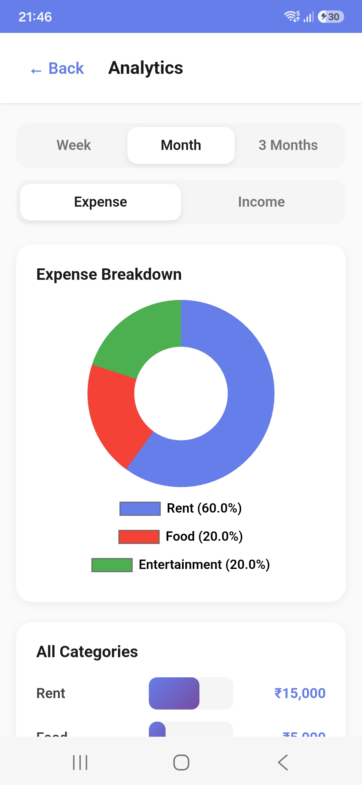
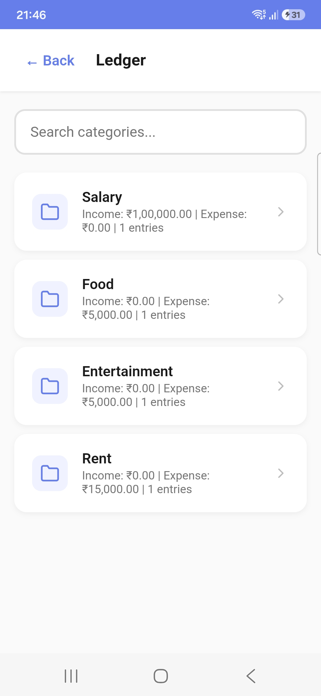
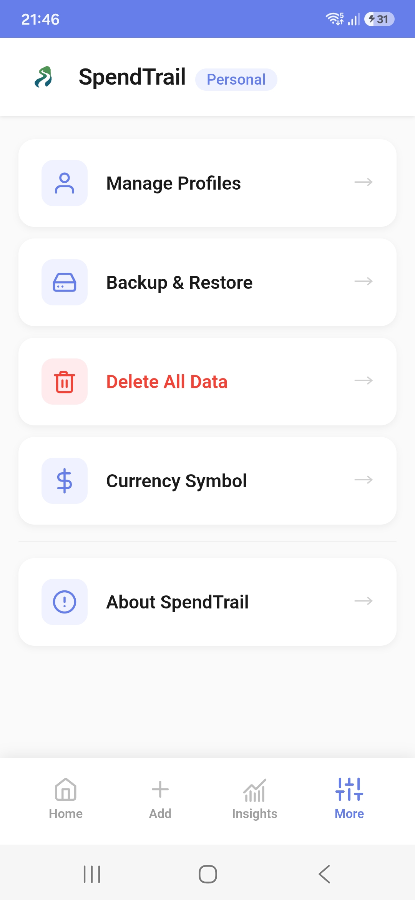

<div align="center">
  
  <h1>SpendTrail</h1>
  <p>A modern, privacy-focused expense and income tracker with multi-profile and multi-currency support, built as a Progressive Web App.</p>

[](https://mananmadani.github.io/SpendTrail/)
[](https://github.com/mananmadani/SpendTrail)
[]()
[]()
[]()

</div>

---

## 📖 About

SpendTrail is a lightweight, privacy-first expense tracker that runs entirely in your browser. No servers, no accounts, no tracking — just you and your financial data. Built with vanilla JavaScript, it works seamlessly across all devices and functions fully offline after the first visit.

---

## 📸 Screenshots

<div align="center">







</div>

---

## ✨ Features

### Core
- 📊 **Income & Expense Tracking** — intuitive entry with categories and notes
- 💱 **Multi-Currency Support** — 30 currency symbols (₹, $, €, £, ¥ and more)
- 📈 **Visual Analytics** — pie charts, bar graphs, and daily trend lines
- 💰 **Real-Time Balance** — instant financial overview on the home screen
- 🔍 **Smart Search** — filter transactions by category or note in real-time
- 📋 **Complete Ledger** — browse all entries with income/expense filters

### Advanced
- 👤 **Multi-Profile** — up to 5 fully isolated profiles (personal, business, travel, family)
- 📅 **Custom Statements** — generate reports for any date range
- 📄 **PDF Export** — professional color-coded reports with summaries and pagination
- 💾 **Backup & Restore** — plain JSON or AES-256 encrypted backups, per profile

### Technical
- 🔒 **100% Private** — all data in browser localStorage, nothing leaves your device
- 📶 **Full Offline Support** — service worker caches app on first visit; works without internet
- 📱 **PWA** — installable as a native app on Android, iOS, and desktop
- ⚡ **No Dependencies** — vanilla JS, no frameworks, no build tools

---

## 🚀 Quick Start

**No installation required.** [Open App](https://mananmadani.github.io/SpendTrail/)

### Install as App

<details>
<summary><b>Android / Chrome</b></summary>

1. Tap [Open App](https://mananmadani.github.io/SpendTrail/) to launch in Chrome
2. Tap menu (⋮) → **"Install app"** or **"Add to Home screen"**
3. SpendTrail appears on your home screen
</details>

<details>
<summary><b>iOS / Safari</b></summary>

1. Tap [Open App](https://mananmadani.github.io/SpendTrail/) in Safari
2. Tap the **Share** button → **"Add to Home Screen"**
3. Tap **"Add"** to confirm
</details>

<details>
<summary><b>Desktop (Chrome, Edge, Brave)</b></summary>

1. Visit [Open App](https://mananmadani.github.io/SpendTrail/) in your browser
2. Click the **install icon** (⊕) in the address bar
3. Click **"Install"**
</details>

---

## 🛠️ Tech Stack

| Category | Technology |
|----------|------------|
| Frontend | Vanilla JavaScript (ES6+) |
| Styling | Custom CSS3 with Flexbox/Grid |
| Storage | localStorage API |
| Offline | Service Workers + Web App Manifest |
| Charts | Chart.js v4.4.0 |
| PDF | jsPDF v2.5.1 |
| Encryption | CryptoJS v4.1.1 (AES-256) |

---

## 💻 Local Development

```bash
# Clone the repository
git clone https://github.com/mananmadani/SpendTrail.git
cd SpendTrail

# Open directly in browser
open index.html

# Or run a local server (recommended for PWA features)
python -m http.server 8000
# Visit http://localhost:8000
```

---

## 📁 Project Structure

```
SpendTrail/
├── index.html          # App entry point
├── app.js              # Core application logic
├── style.css           # Styles and animations
├── manifest.json       # PWA manifest
├── service-worker.js   # Offline caching
├── SpendTrail.png      # App icon (1024x1024)
├── screenshots/        # App screenshots
├── README.md           # This file
├── CHANGELOG.md        # Full version history
├── USER_GUIDE.md       # Detailed usage instructions
├── LICENSE             # MIT License
└── .gitignore
```

---

## 🌍 Supported Currencies

30 currencies across the globe:

**Asia:** INR · JPY · CNY · SGD · HKD · MYR · THB · IDR · PKR · BDT · KRW  
**Europe:** EUR · GBP · CHF · SEK · NOK · DKK · PLN · TRY · RUB  
**Americas:** USD · CAD · BRL · MXN · AUD · NZD  
**Middle East:** AED · SAR · QAR  
**Africa:** ZAR  

> Currency selection changes the display symbol only. No conversion is performed. Each profile has its own currency setting.

---

## 🔒 Privacy & Security

- ✅ All data stored locally in your browser — never sent anywhere
- ✅ No accounts, no registration, no email required
- ✅ No analytics, cookies, or trackers of any kind
- ✅ Each profile's data is fully namespaced and isolated
- 🔐 AES-256 encryption available for backup files
- 📶 Service worker operates fully offline — no background requests

See full details in the app under **More → Privacy Policy**.

---

## 📚 Documentation

- 📋 **[User Guide](USER_GUIDE.md)** — detailed instructions for all features
- 📝 **[Changelog](CHANGELOG.md)** — full version history and release notes

---

## 🤝 Contributing

Contributions, issues, and feature requests are welcome!

1. Fork the project
2. Create your feature branch: `git checkout -b feature/AmazingFeature`
3. Commit your changes: `git commit -m 'Add AmazingFeature'`
4. Push to the branch: `git push origin feature/AmazingFeature`
5. Open a Pull Request

Please test on multiple browsers and update documentation where needed.

---

## 📄 License

Licensed under the [MIT License](LICENSE).  
Free to use, modify, and distribute. No warranty provided.

---

## 👨‍💻 Author

**Manan Madani**

🐙 [GitHub Profile](https://github.com/mananmadani) &nbsp;·&nbsp; 🌐 [SpendTrail Repo](https://github.com/mananmadani/SpendTrail) &nbsp;·&nbsp; 🐛 [Report an Issue](https://github.com/mananmadani/SpendTrail/issues)

---

## ⭐ Support the Project

If SpendTrail helped you manage your finances, consider:

- ⭐ Starring the repository
- 🐛 Reporting bugs
- 💡 Suggesting features
- 📢 Sharing with others

---

<div align="center">
  <sub>Made with ❤️ for better financial tracking</sub>
</div>
